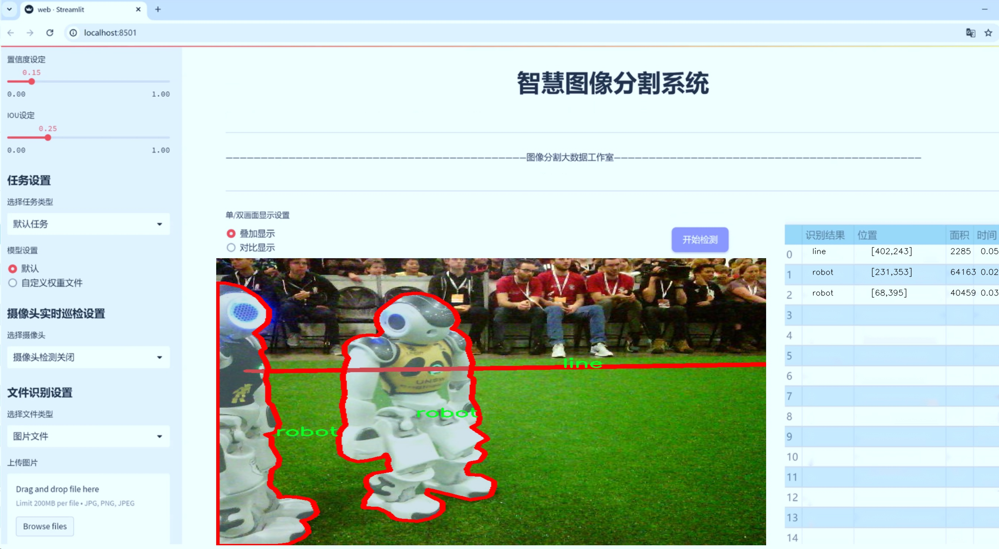
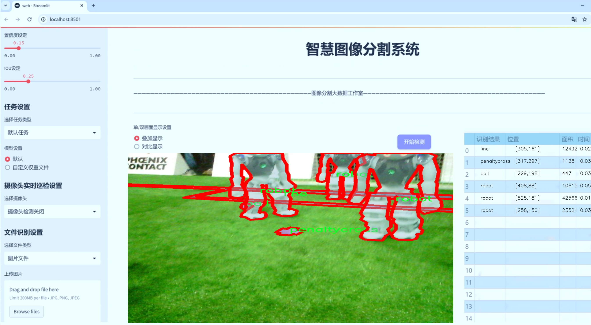
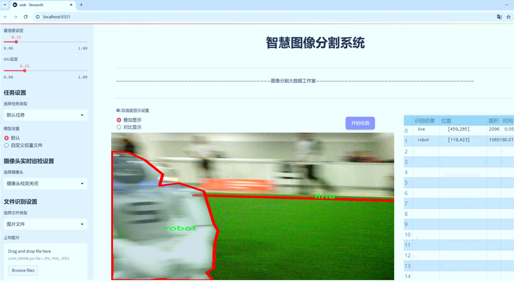
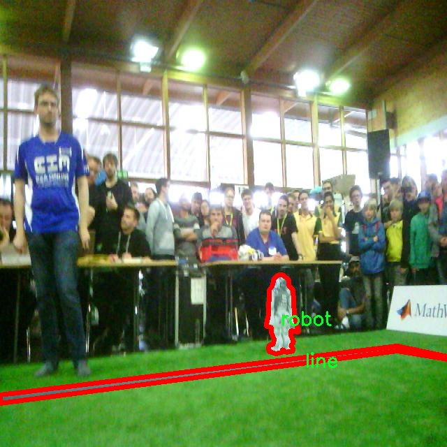
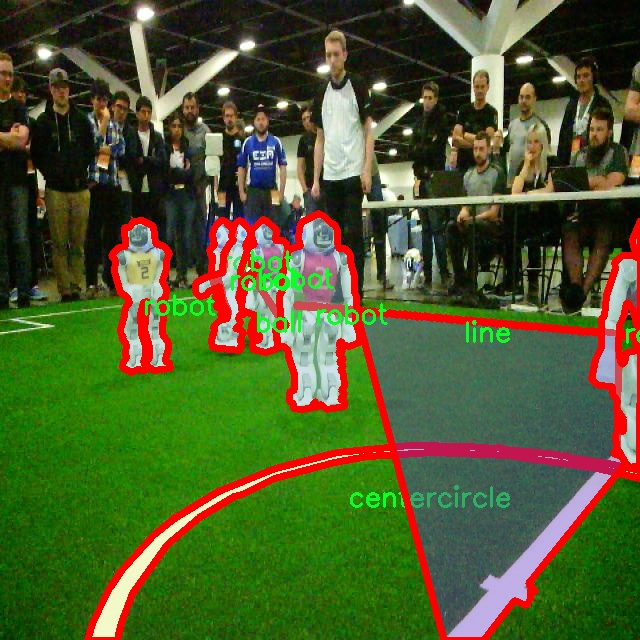
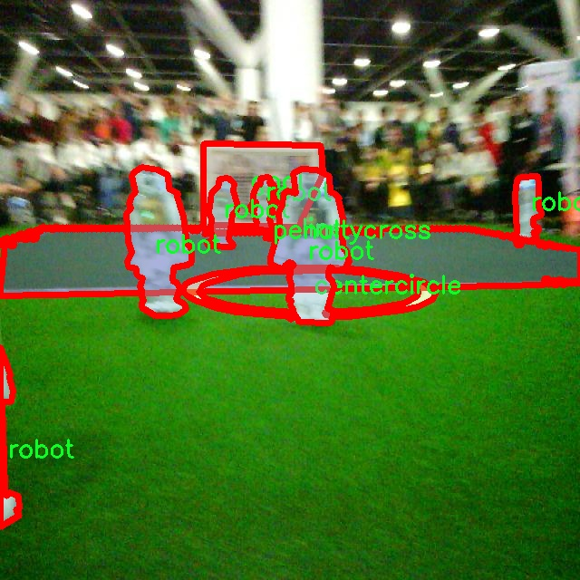
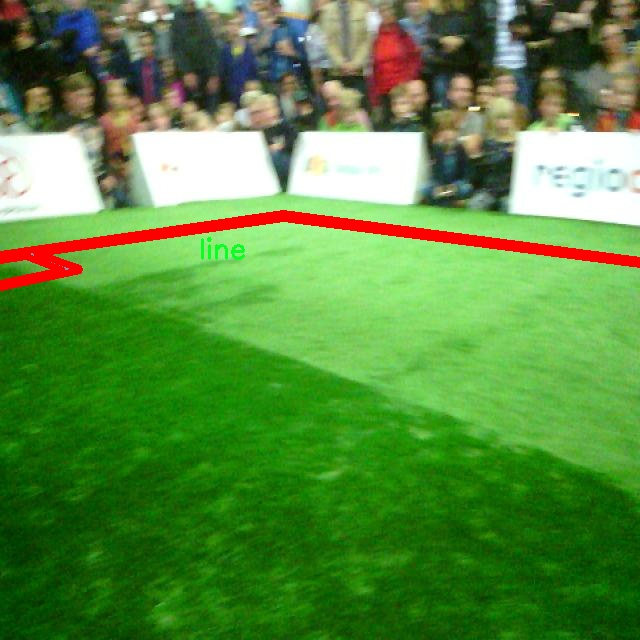
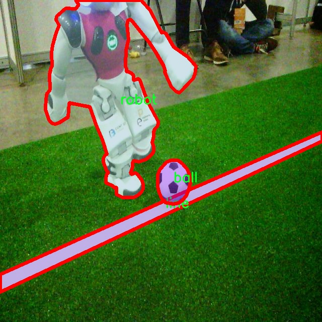

# 机器人足球场景分割系统： yolov8-seg-C2f-DCNV2

### 1.研究背景与意义

[参考博客](https://gitee.com/YOLOv8_YOLOv11_Segmentation_Studio/projects)

[博客来源](https://kdocs.cn/l/cszuIiCKVNis)

研究背景与意义

随着人工智能技术的迅猛发展，计算机视觉在各个领域的应用日益广泛，尤其是在机器人技术中，视觉感知能力的提升对于机器人的自主决策和环境理解至关重要。机器人足球作为一种复杂的多智能体系统，不仅要求机器人具备高度的运动控制能力，还需要其能够实时感知和理解足球场景中的各种元素。因此，构建一个高效的场景分割系统，对于提升机器人在足球比赛中的表现具有重要的现实意义。

在机器人足球比赛中，场景分割的任务主要包括对球、机器人、球门、罚球区等关键元素的识别与定位。现有的场景分割技术虽然在静态图像处理上取得了一定的进展，但在动态环境下的实时处理能力仍显不足。为此，基于改进YOLOv8的机器人足球场景分割系统应运而生。YOLO（You Only Look Once）系列模型以其高效的实时检测能力和较好的精度，成为了目标检测领域的主流选择。通过对YOLOv8模型的改进，结合特定的足球场景数据集，可以显著提升机器人在复杂环境中的目标识别和分割能力。

本研究所使用的数据集“robocup spl”包含1200张图像，涵盖了6个类别，包括球、中心圈、球门、场地线、罚球区和机器人。这些类别的多样性和复杂性为模型的训练提供了丰富的样本，使得模型能够学习到不同场景下的特征和变化。此外，数据集中包含的多种元素相互之间的关系，如球与机器人之间的相对位置、球门与罚球区的空间布局等，为模型的深度学习提供了良好的基础。这些特征的提取和理解，将直接影响到机器人在比赛中的战术决策和运动策略。

通过改进YOLOv8模型，本研究旨在提高机器人在足球场景中的分割精度和实时性，使其能够在快速变化的环境中，准确识别和定位各类目标。这不仅能够提升机器人在比赛中的表现，还能够为后续的智能决策和战术规划提供可靠的数据支持。同时，基于该系统的研究也为其他领域的机器人应用提供了借鉴，推动了计算机视觉技术在动态环境下的进一步发展。

综上所述，基于改进YOLOv8的机器人足球场景分割系统的研究，不仅具有重要的理论价值，还具有广泛的应用前景。通过提升机器人对足球场景的理解能力，能够为未来的智能机器人技术发展奠定坚实的基础，推动机器人在复杂环境中的自主学习和适应能力的提升。

### 2.图片演示







注意：本项目提供完整的训练源码数据集和训练教程,由于此博客编辑较早,暂不提供权重文件（best.pt）,需要按照6.训练教程进行训练后实现上图效果。

### 3.视频演示

[3.1 视频演示](https://www.bilibili.com/video/BV1pjz1YTEFv/)

### 4.数据集信息

##### 4.1 数据集类别数＆类别名

nc: 6
names: ['ball', 'centercircle', 'goal', 'line', 'penaltycross', 'robot']


##### 4.2 数据集信息简介

数据集信息展示

在本研究中，我们使用了名为“robocup spl”的数据集，以支持改进YOLOv8-seg的机器人足球场景分割系统的训练与验证。该数据集专门为机器人足球领域设计，旨在为自动化系统提供丰富的视觉信息，帮助其在复杂的动态环境中进行有效的场景理解和目标识别。数据集的构建充分考虑了机器人足球比赛的实际情况，涵盖了多种关键元素，确保了训练模型的多样性和实用性。

“robocup spl”数据集包含六个主要类别，分别是：球（ball）、中心圆（centercircle）、球门（goal）、边线（line）、罚球区（penaltycross）和机器人（robot）。这些类别不仅反映了足球场景中的重要组成部分，还为模型提供了必要的上下文信息，使其能够更好地理解和分割场景中的不同元素。每个类别在数据集中都经过精心标注，确保了高质量的训练数据。

首先，球（ball）作为比赛中最重要的元素之一，其在数据集中占据了重要位置。模型需要能够准确识别和定位球的位置，以便在比赛中进行有效的策略规划和决策。其次，中心圆（centercircle）是足球场的一个关键标志，标志着比赛的开始和结束，模型需要能够识别该区域，以便进行战术分析和判断。此外，球门（goal）作为得分的关键区域，其识别对于机器人在比赛中的进攻和防守策略至关重要。

边线（line）和罚球区（penaltycross）则为模型提供了场地的边界信息和规则约束，帮助机器人在比赛中遵循规则并进行有效的移动和操作。边线的准确识别可以防止机器人越界，而罚球区的识别则有助于在特定情况下进行战术调整。最后，机器人（robot）类别的标注使得模型能够识别场上其他机器人的位置和状态，从而实现更为复杂的协作和竞争策略。

数据集的多样性和丰富性使得“robocup spl”成为训练和评估机器人足球场景分割系统的理想选择。通过使用该数据集，研究者能够充分利用不同类别之间的关系，训练出能够在真实比赛环境中表现出色的模型。数据集中的图像不仅涵盖了不同的比赛场景，还包含了各种光照条件和视角变化，这些因素都对模型的鲁棒性提出了挑战。

总之，“robocup spl”数据集为改进YOLOv8-seg的机器人足球场景分割系统提供了坚实的基础。通过对六个类别的深入分析和理解，研究者能够设计出更为精确和高效的模型，从而推动机器人足球技术的发展和应用。数据集的构建不仅考虑了技术需求，还关注了实际应用场景，为未来的研究提供了宝贵的资源和参考。











### 5.项目依赖环境部署教程（零基础手把手教学）

[5.1 环境部署教程链接（零基础手把手教学）](https://www.bilibili.com/video/BV1jG4Ve4E9t/?vd_source=bc9aec86d164b67a7004b996143742dc)


[5.2 安装Python虚拟环境创建和依赖库安装视频教程链接（零基础手把手教学）](https://www.bilibili.com/video/BV1nA4VeYEze/?vd_source=bc9aec86d164b67a7004b996143742dc)

### 6.手把手YOLOV8-seg训练视频教程（零基础手把手教学）

[6.1 手把手YOLOV8-seg训练视频教程（零基础小白有手就能学会）](https://www.bilibili.com/video/BV1cA4VeYETe/?vd_source=bc9aec86d164b67a7004b996143742dc)


按照上面的训练视频教程链接加载项目提供的数据集，运行train.py即可开始训练



     Epoch   gpu_mem       box       obj       cls    labels  img_size
     1/200     0G   0.01576   0.01955  0.007536        22      1280: 100%|██████████| 849/849 [14:42<00:00,  1.04s/it]
               Class     Images     Labels          P          R     mAP@.5 mAP@.5:.95: 100%|██████████| 213/213 [01:14<00:00,  2.87it/s]
                 all       3395      17314      0.994      0.957      0.0957      0.0843

     Epoch   gpu_mem       box       obj       cls    labels  img_size
     2/200     0G   0.01578   0.01923  0.007006        22      1280: 100%|██████████| 849/849 [14:44<00:00,  1.04s/it]
               Class     Images     Labels          P          R     mAP@.5 mAP@.5:.95: 100%|██████████| 213/213 [01:12<00:00,  2.95it/s]
                 all       3395      17314      0.996      0.956      0.0957      0.0845

     Epoch   gpu_mem       box       obj       cls    labels  img_size
     3/200     0G   0.01561    0.0191  0.006895        27      1280: 100%|██████████| 849/849 [10:56<00:00,  1.29it/s]
               Class     Images     Labels          P          R     mAP@.5 mAP@.5:.95: 100%|███████   | 187/213 [00:52<00:00,  4.04it/s]
                 all       3395      17314      0.996      0.957      0.0957      0.0845


### 7.50+种全套YOLOV8-seg创新点加载调参实验视频教程（一键加载写好的改进模型的配置文件）

[7.1 50+种全套YOLOV8-seg创新点加载调参实验视频教程（一键加载写好的改进模型的配置文件）](https://www.bilibili.com/video/BV1Hw4VePEXv/?vd_source=bc9aec86d164b67a7004b996143742dc)

### YOLOV8-seg算法简介

原始YOLOv8-seg算法原理

YOLOv8-seg算法是YOLO系列中的最新进展，专注于目标检测与分割任务的结合，尤其是在复杂环境下的小目标检测。该算法的核心在于其高效的架构设计和创新的特征提取方法，使其在处理复杂背景和小目标时展现出卓越的性能。YOLOv8-seg不仅继承了YOLO系列的高效性和实时性，还在分割精度上进行了显著提升，适应了更为复杂的应用场景。

YOLOv8-seg的架构主要由输入端、主干网络、Neck端和输出端四个部分组成。输入端负责对输入图像进行预处理，采用Mosaic数据增强、自适应图片缩放和灰度填充等多种方式，确保输入数据的多样性和适应性。这些预处理步骤不仅提高了模型的鲁棒性，还增强了其对不同场景的适应能力。通过这种方式，YOLOv8-seg能够在训练过程中更好地学习到目标的特征，尤其是在背景复杂、目标小且多样的情况下。

在主干网络中，YOLOv8-seg引入了多种卷积结构，如Conv、C2f和SPPF等，以提取图像的深层特征。C2f模块的设计灵感来源于YOLOv7中的E-ELAN结构，通过跨层连接增强了模型的梯度流动性，从而有效改善了检测结果。SPPF模块则通过多个最大池化层处理多尺度特征，进一步提升了网络的特征抽象能力。这种多层次的特征提取方式使得YOLOv8-seg在处理小目标时能够捕捉到更细粒度的信息，减少了小目标漏检的现象。

Neck端的设计采用了PAN（Path Aggregation Network）结构，通过上采样和下采样的方式对不同尺度的特征图进行融合。这一过程不仅保留了多尺度特征的信息，还增强了特征图之间的上下文关联性，使得模型在面对复杂背景时能够更好地理解目标的上下文信息。Neck端的特征融合能力为后续的检测和分割任务奠定了坚实的基础。

在输出端，YOLOv8-seg采用了解耦的检测头，分别处理分类和回归任务。这种解耦设计使得模型在进行目标分类和定位时能够更加专注，避免了传统方法中分类和回归相互干扰的问题。YOLOv8-seg使用Task-Aligned Assigner方法对分类分数和回归分数进行加权，以此来匹配正样本。这一过程确保了模型在训练时能够有效学习到目标的特征，提高了检测的准确性。

为了进一步提升模型的性能，YOLOv8-seg在损失计算方面也进行了创新。分类损失采用了二元交叉熵（BCE）计算，而回归损失则使用了分布焦点损失（DFL）和完整交并比（CIoU）损失函数。这些损失函数的设计旨在提高模型的泛化能力和精准度，使得YOLOv8-seg在不同的应用场景中都能保持高效的检测和分割性能。

值得注意的是，YOLOv8-seg在小目标检测方面的优势尤为明显。针对小目标漏检的问题，YOLOv8-seg特别设计了一个更小的检测头，以提升网络对小目标的感知能力。此外，在Neck端引入了GSConv和Slim-neck技术，这些技术不仅保持了模型的精度，还有效降低了计算量，使得YOLOv8-seg在实时应用中表现出色。

总的来说，YOLOv8-seg算法通过其创新的架构设计和高效的特征提取方法，成功地解决了传统YOLO模型在复杂环境下的局限性。其在小目标检测和分割任务中的优越表现，使其成为计算机视觉领域中的一项重要进展。随着YOLOv8-seg的不断发展和优化，未来在更多实际应用场景中，其潜力将得到进一步挖掘，推动目标检测与分割技术的不断进步。


### 9.系统功能展示（检测对象为举例，实际内容以本项目数据集为准）

图9.1.系统支持检测结果表格显示

  图9.2.系统支持置信度和IOU阈值手动调节

  图9.3.系统支持自定义加载权重文件best.pt(需要你通过步骤5中训练获得)

  图9.4.系统支持摄像头实时识别

  图9.5.系统支持图片识别

  图9.6.系统支持视频识别

  图9.7.系统支持识别结果文件自动保存

  图9.8.系统支持Excel导出检测结果数据


### 10.50+种全套YOLOV8-seg创新点原理讲解（非科班也可以轻松写刊发刊，V11版本正在科研待更新）

#### 10.1 由于篇幅限制，每个创新点的具体原理讲解就不一一展开，具体见下列网址中的创新点对应子项目的技术原理博客网址【Blog】：


[10.1 50+种全套YOLOV8-seg创新点原理讲解链接](https://gitee.com/qunmasj/good)

#### 10.2 部分改进模块原理讲解(完整的改进原理见上图和技术博客链接)【如果此小节的图加载失败可以通过CSDN或者Github搜索该博客的标题访问原始博客，原始博客图片显示正常】

### Gold-YOLO


#### Preliminaries
YOLO系列的中间层结构采用了传统的FPN结构，其中包含多个分支用于多尺度特征融合。然而，它只充分融合来自相邻级别的特征，对于其他层次的信息只能间接地进行“递归”获取。

传统的FPN结构在信息传输过程中存在丢失大量信息的问题。这是因为层之间的信息交互仅限于中间层选择的信息，未被选择的信息在传输过程中被丢弃。这种情况导致某个Level的信息只能充分辅助相邻层，而对其他全局层的帮助较弱。因此，整体上信息融合的有效性可能受到限制。
为了避免在传输过程中丢失信息，本文采用了一种新颖的“聚集和分发”机制（GD），放弃了原始的递归方法。该机制使用一个统一的模块来收集和融合所有Level的信息，并将其分发到不同的Level。通过这种方式，作者不仅避免了传统FPN结构固有的信息丢失问题，还增强了中间层的部分信息融合能力，而且并没有显著增加延迟。


#### 低阶聚合和分发分支 Low-stage gather-and-distribute branch
从主干网络中选择输出的B2、B3、B4、B5特征进行融合，以获取保留小目标信息的高分辨率特征。


#### 高阶聚合和分发分支 High-stage gather-and-distribute branch
高级全局特征对齐模块（High-GD）将由低级全局特征对齐模块（Low-GD）生成的特征{P3, P4, P5}进行融合。


Transformer融合模块由多个堆叠的transformer组成，transformer块的数量为L。每个transformer块包括一个多头注意力块、一个前馈网络（FFN）和残差连接。采用与LeViT相同的设置来配置多头注意力块，使用16个通道作为键K和查询Q的头维度，32个通道作为值V的头维度。为了加速推理过程，将层归一化操作替换为批归一化，并将所有的GELU激活函数替换为ReLU。为了增强变换器块的局部连接，在两个1x1卷积层之间添加了一个深度卷积层。同时，将FFN的扩展因子设置为2，以在速度和计算成本之间取得平衡。


信息注入模块(Information injection module)： 高级全局特征对齐模块（High-GD）中的信息注入模块与低级全局特征对齐模块（Low-GD）中的相同。在高级阶段，局部特征（Flocal）等于Pi，因此公式如下所示：


#### 增强的跨层信息流动 Enhanced cross-layer information flow
为了进一步提升性能，从YOLOv6 中的PAFPN模块中得到启发，引入了Inject-LAF模块。该模块是注入模块的增强版，包括了一个轻量级相邻层融合（LAF）模块，该模块被添加到注入模块的输入位置。为了在速度和准确性之间取得平衡，设计了两个LAF模型：LAF低级模型和LAF高级模型，分别用于低级注入（合并相邻两层的特征）和高级注入（合并相邻一层的特征）。它们的结构如图5(b)所示。为了确保来自不同层级的特征图与目标大小对齐，在实现中的两个LAF模型仅使用了三个操作符：双线性插值（上采样过小的特征）、平均池化（下采样过大的特征）和1x1卷积（调整与目标通道不同的特征）。模型中的LAF模块与信息注入模块的结合有效地平衡了准确性和速度之间的关系。通过使用简化的操作，能够增加不同层级之间的信息流路径数量，从而提高性能而不显著增加延迟。


### 11.项目核心源码讲解（再也不用担心看不懂代码逻辑）

#### 11.1 ultralytics\models\nas\predict.py

以下是经过简化和注释的核心代码部分：

```python
# 导入必要的库
import torch
from ultralytics.engine.predictor import BasePredictor
from ultralytics.engine.results import Results
from ultralytics.utils import ops

class NASPredictor(BasePredictor):
    """
    Ultralytics YOLO NAS预测器，用于目标检测。

    该类扩展了Ultralytics引擎中的`BasePredictor`，负责对YOLO NAS模型生成的原始预测结果进行后处理。
    它应用了非极大值抑制（NMS）和将边界框缩放到原始图像尺寸等操作。

    属性:
        args (Namespace): 包含各种后处理配置的命名空间。
    """

    def postprocess(self, preds_in, img, orig_imgs):
        """对预测结果进行后处理，并返回Results对象的列表。"""

        # 将预测框从xyxy格式转换为xywh格式
        boxes = ops.xyxy2xywh(preds_in[0][0])
        # 将边界框和类分数拼接在一起，并调整维度
        preds = torch.cat((boxes, preds_in[0][1]), -1).permute(0, 2, 1)

        # 应用非极大值抑制，过滤掉重叠的边界框
        preds = ops.non_max_suppression(preds,
                                        self.args.conf,  # 置信度阈值
                                        self.args.iou,   # IOU阈值
                                        agnostic=self.args.agnostic_nms,  # 是否对类别不敏感
                                        max_det=self.args.max_det,  # 最大检测数量
                                        classes=self.args.classes)  # 过滤特定类别

        # 如果输入图像不是列表，则将其转换为numpy数组
        if not isinstance(orig_imgs, list):
            orig_imgs = ops.convert_torch2numpy_batch(orig_imgs)

        results = []  # 存储结果的列表
        for i, pred in enumerate(preds):
            orig_img = orig_imgs[i]  # 获取原始图像
            # 将预测框缩放到原始图像的尺寸
            pred[:, :4] = ops.scale_boxes(img.shape[2:], pred[:, :4], orig_img.shape)
            img_path = self.batch[0][i]  # 获取图像路径
            # 创建Results对象并添加到结果列表中
            results.append(Results(orig_img, path=img_path, names=self.model.names, boxes=pred))
        
        return results  # 返回处理后的结果列表
```

### 代码核心部分说明：
1. **类定义**：`NASPredictor` 继承自 `BasePredictor`，主要用于YOLO NAS模型的后处理。
2. **后处理方法**：`postprocess` 方法对模型的原始预测结果进行处理，包括边界框格式转换、非极大值抑制、缩放边界框等。
3. **非极大值抑制**：通过 `ops.non_max_suppression` 函数来过滤掉重叠的边界框，保留最有可能的检测结果。
4. **结果存储**：处理后的结果以 `Results` 对象的形式存储，包含原始图像、图像路径、类别名称和边界框信息。

这个文件是Ultralytics YOLO（You Only Look Once）模型中的一个预测模块，主要用于处理YOLO NAS（Neural Architecture Search）模型的预测结果。文件中定义了一个名为`NASPredictor`的类，它继承自`BasePredictor`，负责对YOLO NAS模型生成的原始预测结果进行后处理。

在这个类中，首先定义了一个`postprocess`方法，该方法的主要功能是对输入的预测结果进行后处理，并返回一个包含结果的列表。后处理的过程包括几个步骤：

1. **框和类分数的合并**：首先，将输入的预测结果中的边界框坐标转换为另一种格式（xywh），并将边界框和类分数进行拼接，以便后续处理。

2. **非极大值抑制（NMS）**：接下来，使用非极大值抑制算法来过滤掉重叠的边界框。这个步骤是为了确保最终输出的边界框是最优的，避免重复检测同一物体。NMS的参数如置信度阈值、IOU阈值等，都是从类的属性中获取的。

3. **图像格式转换**：如果输入的原始图像不是列表格式（即是一个torch张量），则将其转换为numpy数组格式，以便后续处理。

4. **边界框缩放**：对于每个预测结果，使用`scale_boxes`函数将边界框的坐标缩放到原始图像的尺寸，以确保输出的边界框能够正确地对应到原始图像上。

5. **结果存储**：最后，将处理后的结果存储在一个`Results`对象中，包括原始图像、图像路径、类别名称和边界框信息，并将这些结果添加到一个列表中返回。

这个类通常不会被直接实例化，而是在`NAS`类内部使用。通过这个模块，用户可以方便地对YOLO NAS模型的预测结果进行处理，获取最终的检测结果。

#### 11.2 ultralytics\data\augment.py

以下是代码中最核心的部分，并附上详细的中文注释：

```python
class BaseTransform:
    """
    图像变换的基础类。

    该类是一个通用的变换类，可以根据特定的图像处理需求进行扩展。
    该类旨在与分类和语义分割任务兼容。

    方法：
        __init__: 初始化 BaseTransform 对象。
        apply_image: 对标签应用图像变换。
        apply_instances: 对标签中的对象实例应用变换。
        apply_semantic: 对图像应用语义分割变换。
        __call__: 对图像、实例和语义掩码应用所有标签变换。
    """

    def __init__(self) -> None:
        """初始化 BaseTransform 对象。"""
        pass

    def apply_image(self, labels):
        """对标签应用图像变换。"""
        pass

    def apply_instances(self, labels):
        """对标签中的对象实例应用变换。"""
        pass

    def apply_semantic(self, labels):
        """对图像应用语义分割变换。"""
        pass

    def __call__(self, labels):
        """对图像、实例和语义掩码应用所有标签变换。"""
        self.apply_image(labels)
        self.apply_instances(labels)
        self.apply_semantic(labels)


class Mosaic(BaseMixTransform):
    """
    马赛克增强。

    该类通过将多个（4或9）图像组合成一个马赛克图像来执行马赛克增强。
    增强是以给定的概率应用于数据集。

    属性：
        dataset: 应用马赛克增强的数据集。
        imgsz (int, optional): 单个图像的马赛克管道后的图像大小（高度和宽度）。默认为640。
        p (float, optional): 应用马赛克增强的概率。必须在0-1范围内。默认为1.0。
        n (int, optional): 网格大小，4（2x2）或9（3x3）。
    """

    def __init__(self, dataset, imgsz=640, p=1.0, n=4):
        """初始化对象，设置数据集、图像大小、概率和边界。"""
        assert 0 <= p <= 1.0, f'概率应在[0, 1]范围内，但得到的是 {p}。'
        assert n in (4, 9), '网格必须等于4或9。'
        super().__init__(dataset=dataset, p=p)
        self.dataset = dataset
        self.imgsz = imgsz
        self.border = (-imgsz // 2, -imgsz // 2)  # 边界宽度和高度
        self.n = n

    def get_indexes(self, buffer=True):
        """返回数据集中随机索引的列表。"""
        if buffer:  # 从缓冲区选择图像
            return random.choices(list(self.dataset.buffer), k=self.n - 1)
        else:  # 选择任何图像
            return [random.randint(0, len(self.dataset) - 1) for _ in range(self.n - 1)]

    def _mix_transform(self, labels):
        """对标签字典应用 MixUp 或 Mosaic 增强。"""
        assert labels.get('rect_shape', None) is None, '矩形和马赛克是互斥的。'
        assert len(labels.get('mix_labels', [])), '没有其他图像用于马赛克增强。'
        return self._mosaic4(labels) if self.n == 4 else self._mosaic9(labels)

    def _mosaic4(self, labels):
        """创建一个 2x2 图像马赛克。"""
        mosaic_labels = []
        s = self.imgsz
        yc, xc = (int(random.uniform(-x, 2 * s + x)) for x in self.border)  # 马赛克中心 x, y
        for i in range(4):
            labels_patch = labels if i == 0 else labels['mix_labels'][i - 1]
            img = labels_patch['img']
            h, w = labels_patch.pop('resized_shape')

            # 将图像放置在 img4 中
            if i == 0:  # 左上角
                img4 = np.full((s * 2, s * 2, img.shape[2]), 114, dtype=np.uint8)  # 基础图像，包含4个图块
                x1a, y1a, x2a, y2a = max(xc - w, 0), max(yc - h, 0), xc, yc  # 大图的 xmin, ymin, xmax, ymax
                x1b, y1b, x2b, y2b = w - (x2a - x1a), h - (y2a - y1a), w, h  # 小图的 xmin, ymin, xmax, ymax
            # 其他位置的处理类似...
            # 省略其他代码以简化示例

        final_labels = self._cat_labels(mosaic_labels)
        final_labels['img'] = img4
        return final_labels

    def _cat_labels(self, mosaic_labels):
        """返回带有马赛克边界实例剪裁的标签。"""
        if len(mosaic_labels) == 0:
            return {}
        cls = []
        instances = []
        imgsz = self.imgsz * 2  # 马赛克图像大小
        for labels in mosaic_labels:
            cls.append(labels['cls'])
            instances.append(labels['instances'])
        final_labels = {
            'im_file': mosaic_labels[0]['im_file'],
            'ori_shape': mosaic_labels[0]['ori_shape'],
            'resized_shape': (imgsz, imgsz),
            'cls': np.concatenate(cls, 0),
            'instances': Instances.concatenate(instances, axis=0),
            'mosaic_border': self.border}  # 最终标签
        final_labels['instances'].clip(imgsz, imgsz)
        good = final_labels['instances'].remove_zero_area_boxes()
        final_labels['cls'] = final_labels['cls'][good]
        return final_labels
```

### 主要核心部分说明：
1. **BaseTransform 类**：这是一个基础变换类，定义了图像处理的基本接口，子类可以实现具体的图像变换方法。
2. **Mosaic 类**：实现了马赛克增强，通过将多个图像组合成一个图像来增加数据的多样性。它包含了获取随机索引、应用增强和合并标签的逻辑。
3. **_mosaic4 和 _cat_labels 方法**：具体实现了如何创建 2x2 的马赛克图像和合并标签的逻辑。

这些核心部分构成了图像增强的基础，适用于目标检测和图像分割等任务。

这个程序文件`ultralytics\data\augment.py`主要实现了一系列图像增强的功能，旨在为计算机视觉任务（如目标检测和图像分类）提供数据增强手段。文件中定义了多个类和方法，用于对图像及其对应的标签进行各种变换，以提高模型的泛化能力。

首先，文件导入了一些必要的库，包括数学运算、随机数生成、OpenCV、NumPy、PyTorch等。接着，定义了一个`BaseTransform`类，这是一个基础的图像变换类，提供了初始化和应用图像、实例和语义分割标签的方法。这个类可以被其他具体的变换类继承和扩展。

`Compose`类用于将多个图像变换组合在一起，提供了按顺序应用这些变换的功能。它允许用户将多个变换组合成一个操作，以便在处理数据时更加方便。

`BaseMixTransform`类是一个用于实现混合增强（如MixUp和Mosaic）的基类。它的子类可以实现具体的混合增强方法。`Mosaic`类实现了马赛克增强，通过将多个图像组合成一个马赛克图像来增强数据。该类支持4个或9个图像的组合，并提供了获取随机索引和更新标签的方法。

`MixUp`类则实现了MixUp增强，通过对两张图像进行加权平均来生成新的图像，同时更新标签信息。

`RandomPerspective`类实现了随机透视变换和仿射变换，可以对图像及其对应的边界框、分割和关键点进行旋转、平移、缩放和剪切等操作。

`RandomHSV`类用于随机调整图像的色调、饱和度和亮度，增加图像的多样性。`RandomFlip`类则提供了随机翻转图像的功能，支持水平和垂直翻转，并相应地更新边界框和关键点。

`LetterBox`类用于调整图像大小并添加边框，以适应目标检测和实例分割任务。`CopyPaste`类实现了复制粘贴增强，允许将一个图像中的实例复制到另一个图像中，以增加数据的多样性。

`Albumentations`类是一个可选的增强类，使用Albumentations库实现了一系列图像增强方法，如模糊、对比度调整、亮度变化等。

最后，`Format`类用于格式化图像注释，以便在PyTorch的DataLoader中使用。它标准化图像和实例注释，确保它们的格式符合模型的输入要求。

文件还提供了一些用于YOLOv8训练的转换函数，如`v8_transforms`和`classify_transforms`，用于生成适合YOLOv8模型的图像和标签。

整体而言，这个文件实现了丰富的图像增强功能，通过多种变换和组合方法，帮助提高模型在不同场景下的表现。

#### 11.3 ultralytics\nn\extra_modules\ops_dcnv3\modules\__init__.py

以下是保留的核心代码部分，并添加了详细的中文注释：

```python
# 导入所需的模块
from .dcnv3 import DCNv3, DCNv3_pytorch, DCNv3_DyHead

# 这里的代码从当前包的 dcnv3 模块中导入了三个类或函数：
# 1. DCNv3：可能是一个深度可分离卷积网络的实现。
# 2. DCNv3_pytorch：可能是基于 PyTorch 框架的 DCNv3 实现。
# 3. DCNv3_DyHead：可能是与动态头部相关的实现，通常用于目标检测等任务。

# 这些导入的类或函数可能在后续的代码中被用来构建模型或进行特定的计算。
```

在这段代码中，主要的功能是导入 `dcnv3` 模块中的特定组件，以便在后续的代码中使用。这些组件可能与深度学习模型的构建和训练有关。

这个程序文件是一个Python模块的初始化文件，位于`ultralytics/nn/extra_modules/ops_dcnv3/modules/`目录下。文件的开头包含了一些版权信息，表明该代码属于OpenGVLab，并且遵循MIT许可证。这意味着用户可以自由使用、修改和分发该代码，只要遵循许可证的条款。

在文件的主体部分，使用了`from`语句导入了三个类或函数：`DCNv3`、`DCNv3_pytorch`和`DCNv3_DyHead`。这些类或函数的具体实现应该在同一目录下的`dcnv3.py`文件中。通过这种方式，用户在导入这个模块时，可以直接使用这三个导入的组件，而不需要知道它们的具体实现细节。

整体来看，这个文件的主要作用是将`dcnv3.py`中的特定功能或类暴露给外部使用，方便其他模块或用户进行调用和使用。

#### 11.4 ultralytics\utils\callbacks\neptune.py

以下是代码中最核心的部分，并附上详细的中文注释：

```python
# 导入必要的库
from ultralytics.utils import LOGGER, SETTINGS, TESTS_RUNNING

# 尝试导入Neptune库并进行初始化
try:
    assert not TESTS_RUNNING  # 确保不是在测试环境中
    assert SETTINGS['neptune'] is True  # 确保Neptune集成已启用
    import neptune
    from neptune.types import File

    assert hasattr(neptune, '__version__')  # 确保Neptune库版本存在

    run = None  # NeptuneAI实验记录实例

except (ImportError, AssertionError):
    neptune = None  # 如果导入失败，设置neptune为None


def _log_scalars(scalars, step=0):
    """将标量数据记录到NeptuneAI实验记录器中。"""
    if run:  # 如果Neptune运行实例存在
        for k, v in scalars.items():  # 遍历标量字典
            run[k].append(value=v, step=step)  # 记录标量值和步骤


def _log_images(imgs_dict, group=''):
    """将图像记录到NeptuneAI实验记录器中。"""
    if run:  # 如果Neptune运行实例存在
        for k, v in imgs_dict.items():  # 遍历图像字典
            run[f'{group}/{k}'].upload(File(v))  # 上传图像文件


def on_pretrain_routine_start(trainer):
    """在训练例程开始前调用的回调函数。"""
    try:
        global run
        # 初始化Neptune运行，设置项目和名称
        run = neptune.init_run(project=trainer.args.project or 'YOLOv8', name=trainer.args.name, tags=['YOLOv8'])
        # 记录超参数配置
        run['Configuration/Hyperparameters'] = {k: '' if v is None else v for k, v in vars(trainer.args).items()}
    except Exception as e:
        LOGGER.warning(f'WARNING ⚠️ NeptuneAI安装但未正确初始化，未记录此运行。 {e}')


def on_train_epoch_end(trainer):
    """每个训练周期结束时调用的回调函数。"""
    _log_scalars(trainer.label_loss_items(trainer.tloss, prefix='train'), trainer.epoch + 1)  # 记录训练损失
    _log_scalars(trainer.lr, trainer.epoch + 1)  # 记录学习率
    if trainer.epoch == 1:  # 如果是第一个周期
        # 记录训练过程中的图像
        _log_images({f.stem: str(f) for f in trainer.save_dir.glob('train_batch*.jpg')}, 'Mosaic')


def on_val_end(validator):
    """每次验证结束时调用的回调函数。"""
    if run:
        # 记录验证集的图像
        _log_images({f.stem: str(f) for f in validator.save_dir.glob('val*.jpg')}, 'Validation')


def on_train_end(trainer):
    """训练结束时调用的回调函数。"""
    if run:
        # 记录最终结果，包括混淆矩阵和PR曲线
        files = [
            'results.png', 'confusion_matrix.png', 'confusion_matrix_normalized.png',
            *(f'{x}_curve.png' for x in ('F1', 'PR', 'P', 'R'))]
        files = [(trainer.save_dir / f) for f in files if (trainer.save_dir / f).exists()]  # 过滤存在的文件
        for f in files:
            _log_plot(title=f.stem, plot_path=f)  # 记录图表
        # 记录最终模型
        run[f'weights/{trainer.args.name or trainer.args.task}/{str(trainer.best.name)}'].upload(File(str(trainer.best)))


# 定义回调函数字典
callbacks = {
    'on_pretrain_routine_start': on_pretrain_routine_start,
    'on_train_epoch_end': on_train_epoch_end,
    'on_fit_epoch_end': on_fit_epoch_end,
    'on_val_end': on_val_end,
    'on_train_end': on_train_end} if neptune else {}
```

### 代码核心部分解释：
1. **Neptune初始化**：尝试导入Neptune库并初始化一个运行实例，用于记录实验数据。
2. **记录标量和图像**：定义了 `_log_scalars` 和 `_log_images` 函数，用于将训练过程中的标量（如损失、学习率）和图像（如训练结果图）记录到Neptune。
3. **回调函数**：定义了多个回调函数，在训练的不同阶段（如开始、每个周期结束、验证结束和训练结束）记录相关数据。
4. **回调字典**：将所有回调函数存储在一个字典中，以便在训练过程中调用。

这个程序文件是一个用于集成NeptuneAI的回调函数模块，主要用于在训练YOLO模型时记录实验数据和结果。首先，文件导入了一些必要的模块和库，包括日志记录器、设置和测试状态的变量。接着，尝试导入Neptune库，并检查其版本，确保Neptune集成已启用。如果导入失败或设置不正确，则将`neptune`变量设置为`None`。

接下来，定义了一些辅助函数来记录不同类型的数据。`_log_scalars`函数用于记录标量数据，例如损失值和学习率；`_log_images`函数用于记录图像数据，通常是训练过程中的样本图像；`_log_plot`函数用于记录绘图数据，比如训练结果的可视化图。

在训练的不同阶段，程序会调用相应的回调函数。例如，`on_pretrain_routine_start`函数在训练开始前被调用，用于初始化Neptune的运行实例并记录超参数配置。`on_train_epoch_end`函数在每个训练周期结束时被调用，记录训练损失和学习率，并在第一轮结束时记录训练图像。`on_fit_epoch_end`函数在每个训练和验证周期结束时被调用，记录模型信息和指标。`on_val_end`函数在验证结束时被调用，记录验证图像。最后，`on_train_end`函数在训练结束时被调用，记录最终结果和模型权重。

最后，程序将这些回调函数组织成一个字典，方便在训练过程中根据需要调用。如果Neptune未正确初始化，则字典将为空。整体而言，这个模块为YOLO模型的训练过程提供了灵活的日志记录功能，便于后续分析和可视化。

#### 11.5 ultralytics\solutions\__init__.py

以下是代码的核心部分，并附上详细的中文注释：

```python
# Ultralytics YOLO 🚀, AGPL-3.0 license

# 这是一个YOLO（You Only Look Once）模型的实现，YOLO是一种用于目标检测的深度学习模型。
# Ultralytics是一个开发和维护YOLO模型的团队。

# 代码的具体实现部分没有给出，但一般来说，YOLO模型的核心部分包括以下几个步骤：

# 1. 数据预处理：将输入图像调整为模型所需的尺寸，并进行归一化处理。
# 2. 模型构建：定义YOLO模型的网络结构，包括卷积层、激活函数等。
# 3. 前向传播：将输入图像通过模型进行前向传播，得到特征图。
# 4. 目标检测：根据特征图生成边界框（bounding boxes）和类别概率。
# 5. 后处理：对模型输出进行处理，筛选出高置信度的检测结果，并进行非极大值抑制（NMS）以去除冗余框。

# 具体的实现代码可能包括：
# - 导入必要的库（如PyTorch、NumPy等）
# - 定义模型类，包含网络结构的构建和前向传播方法
# - 加载预训练权重
# - 实现训练和推理的逻辑

# 由于原始代码未提供具体实现，以上是YOLO模型的核心步骤和逻辑。
```

请注意，由于原始代码只包含了一个注释行，因此这里提供的是YOLO模型的一般性描述和核心步骤的注释。

这个程序文件的文件名是 `__init__.py`，位于 `ultralytics/solutions` 目录下。根据文件名和路径，我们可以推测这个文件是一个 Python 包的初始化文件。它的主要作用是将 `solutions` 目录标识为一个 Python 包，使得该目录下的模块可以被导入和使用。

文件中的注释 `# Ultralytics YOLO 🚀, AGPL-3.0 license` 表明这个包与 Ultralytics YOLO（一个流行的目标检测模型）相关，并且使用 AGPL-3.0 许可证。这种许可证要求任何基于该代码的衍生作品也必须开源，并且在分发时必须提供源代码。这表明 Ultralytics 对其代码的开放性和共享性有一定的要求。

总体来说，这个文件的存在是为了支持 Python 包的结构，并且通过注释提供了关于该包的基本信息，包括其归属和许可证类型。

### 12.系统整体结构（节选）

### 整体功能和构架概括

Ultralytics 是一个专注于计算机视觉任务的开源项目，特别是目标检测。该项目实现了 YOLO（You Only Look Once）系列模型，并提供了一系列工具和模块，以便于训练、推理和数据处理。整体架构包括模型定义、数据增强、回调函数、额外模块和解决方案等多个部分。

1. **模型预测**：`predict.py` 文件负责处理 YOLO NAS 模型的预测结果，包括后处理和结果格式化。
2. **数据增强**：`augment.py` 文件实现了多种图像增强技术，帮助提高模型的泛化能力，通过组合多种变换来增强训练数据。
3. **额外模块**：`__init__.py` 文件标识了一个 Python 包，提供了对 DCNv3 模块的访问。
4. **回调函数**：`neptune.py` 文件集成了 NeptuneAI，用于记录训练过程中的各种指标和图像，便于后续分析和可视化。
5. **解决方案**：`__init__.py` 文件标识了一个解决方案包，可能包含特定的模型或功能，但具体实现需要查看该目录下的其他文件。

### 文件功能整理表

| 文件路径                                                | 功能描述                                                                                   |
|-----------------------------------------------------|----------------------------------------------------------------------------------------|
| `ultralytics/models/nas/predict.py`                 | 处理 YOLO NAS 模型的预测结果，包括后处理和结果格式化。                                           |
| `ultralytics/data/augment.py`                       | 实现多种图像增强技术，帮助提高模型的泛化能力，通过组合多种变换来增强训练数据。                       |
| `ultralytics/nn/extra_modules/ops_dcnv3/modules/__init__.py` | 标识 DCNv3 模块的包，提供对 DCNv3 相关类和函数的访问。                                        |
| `ultralytics/utils/callbacks/neptune.py`           | 集成 NeptuneAI 记录训练过程中的指标和图像，便于后续分析和可视化。                               |
| `ultralytics/solutions/__init__.py`                 | 标识解决方案包，可能包含特定的模型或功能，具体实现需查看该目录下的其他文件。                      |

通过这些模块的协同工作，Ultralytics 提供了一个完整的框架，便于用户进行目标检测模型的训练、推理和结果分析。

### 13.图片、视频、摄像头图像分割Demo(去除WebUI)代码

在这个博客小节中，我们将讨论如何在不使用WebUI的情况下，实现图像分割模型的使用。本项目代码已经优化整合，方便用户将分割功能嵌入自己的项目中。
核心功能包括图片、视频、摄像头图像的分割，ROI区域的轮廓提取、类别分类、周长计算、面积计算、圆度计算以及颜色提取等。
这些功能提供了良好的二次开发基础。

### 核心代码解读

以下是主要代码片段，我们会为每一块代码进行详细的批注解释：

```python
import random
import cv2
import numpy as np
from PIL import ImageFont, ImageDraw, Image
from hashlib import md5
from model import Web_Detector
from chinese_name_list import Label_list

# 根据名称生成颜色
def generate_color_based_on_name(name):
    ......

# 计算多边形面积
def calculate_polygon_area(points):
    return cv2.contourArea(points.astype(np.float32))

...
# 绘制中文标签
def draw_with_chinese(image, text, position, font_size=20, color=(255, 0, 0)):
    image_pil = Image.fromarray(cv2.cvtColor(image, cv2.COLOR_BGR2RGB))
    draw = ImageDraw.Draw(image_pil)
    font = ImageFont.truetype("simsun.ttc", font_size, encoding="unic")
    draw.text(position, text, font=font, fill=color)
    return cv2.cvtColor(np.array(image_pil), cv2.COLOR_RGB2BGR)

# 动态调整参数
def adjust_parameter(image_size, base_size=1000):
    max_size = max(image_size)
    return max_size / base_size

# 绘制检测结果
def draw_detections(image, info, alpha=0.2):
    name, bbox, conf, cls_id, mask = info['class_name'], info['bbox'], info['score'], info['class_id'], info['mask']
    adjust_param = adjust_parameter(image.shape[:2])
    spacing = int(20 * adjust_param)

    if mask is None:
        x1, y1, x2, y2 = bbox
        aim_frame_area = (x2 - x1) * (y2 - y1)
        cv2.rectangle(image, (x1, y1), (x2, y2), color=(0, 0, 255), thickness=int(3 * adjust_param))
        image = draw_with_chinese(image, name, (x1, y1 - int(30 * adjust_param)), font_size=int(35 * adjust_param))
        y_offset = int(50 * adjust_param)  # 类别名称上方绘制，其下方留出空间
    else:
        mask_points = np.concatenate(mask)
        aim_frame_area = calculate_polygon_area(mask_points)
        mask_color = generate_color_based_on_name(name)
        try:
            overlay = image.copy()
            cv2.fillPoly(overlay, [mask_points.astype(np.int32)], mask_color)
            image = cv2.addWeighted(overlay, 0.3, image, 0.7, 0)
            cv2.drawContours(image, [mask_points.astype(np.int32)], -1, (0, 0, 255), thickness=int(8 * adjust_param))

            # 计算面积、周长、圆度
            area = cv2.contourArea(mask_points.astype(np.int32))
            perimeter = cv2.arcLength(mask_points.astype(np.int32), True)
            ......

            # 计算色彩
            mask = np.zeros(image.shape[:2], dtype=np.uint8)
            cv2.drawContours(mask, [mask_points.astype(np.int32)], -1, 255, -1)
            color_points = cv2.findNonZero(mask)
            ......

            # 绘制类别名称
            x, y = np.min(mask_points, axis=0).astype(int)
            image = draw_with_chinese(image, name, (x, y - int(30 * adjust_param)), font_size=int(35 * adjust_param))
            y_offset = int(50 * adjust_param)

            # 绘制面积、周长、圆度和色彩值
            metrics = [("Area", area), ("Perimeter", perimeter), ("Circularity", circularity), ("Color", color_str)]
            for idx, (metric_name, metric_value) in enumerate(metrics):
                ......

    return image, aim_frame_area

# 处理每帧图像
def process_frame(model, image):
    pre_img = model.preprocess(image)
    pred = model.predict(pre_img)
    det = pred[0] if det is not None and len(det)
    if det:
        det_info = model.postprocess(pred)
        for info in det_info:
            image, _ = draw_detections(image, info)
    return image

if __name__ == "__main__":
    cls_name = Label_list
    model = Web_Detector()
    model.load_model("./weights/yolov8s-seg.pt")

    # 摄像头实时处理
    cap = cv2.VideoCapture(0)
    while cap.isOpened():
        ret, frame = cap.read()
        if not ret:
            break
        ......

    # 图片处理
    image_path = './icon/OIP.jpg'
    image = cv2.imread(image_path)
    if image is not None:
        processed_image = process_frame(model, image)
        ......

    # 视频处理
    video_path = ''  # 输入视频的路径
    cap = cv2.VideoCapture(video_path)
    while cap.isOpened():
        ret, frame = cap.read()
        ......
```


### 14.完整训练+Web前端界面+50+种创新点源码、数据集获取


# [下载链接：https://mbd.pub/o/bread/Z5yWlZdw](https://mbd.pub/o/bread/Z5yWlZdw)